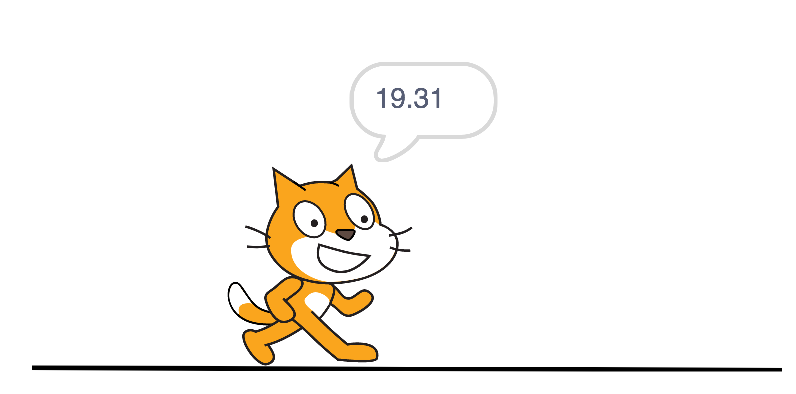

img { float: left; max-width: 20%;}

### Inleiding
Scratch 3 is de nieuwste versie van Scratch en komt in januari 2019 officieel uit. Op dit moment is er een [_beta_ versie](https://beta.scratch.mit.edu) beschikbaar, dit betekent dat nog niet alles af is en er nog dingen kunnen veranderen in de definitieve versie.

**Belangrijk**: het is nog niet mogelijk om _online_ een programma op te slaan, dit moet je op je eigen computer doen. Het is aan te raden dit regelmatig te doen om te zorgen dat je geen werk verliest. Je kunt opgeslagen programma's ook weer uploaden.

{:height="36px"}