### Inleiding
Deze Dojo gaat over Scratch 3, en als je een webcam hebt (ingebouwd of los) kun je in Scratch 3 aan de slag met [*video sensing*](#videosensing).

Scratch 3 is de nieuwste versie van Scratch en komt in januari 2019 officieel uit. Op dit moment is er een [_beta_ versie](https://beta.scratch.mit.edu) beschikbaar, dit betekent dat nog niet alles af is en er nog dingen kunnen veranderen in de definitieve versie.

**Belangrijk**: het is nog niet mogelijk om _online_ een programma op te slaan, dit moet je op je eigen computer doen. Het is aan te raden dit regelmatig te doen om te zorgen dat je geen werk verliest. Je kunt opgeslagen programma's ook weer uploaden.

Scratch is er in een heleboel talen. De plaatjes hieronder zijn in het Nederlands dus is het handig om dat ook als taal te kiezen.

### Video sensing

Je kunt in Scratch programma's schrijven die reageren wat er gebeurt op wat de webcam "ziet", en dan ook de kleur van wat ie ziet. Hier zijn allerlei spelletjes mee te verzinnen. Hieronder staan wat bouwblokken en ideeën die je kunt gebruiken voor je eigen spel. Sommige zijn meer geschikt voor een ingebouwde webcam en sommige meer voor een losse.

Begin met het aanzetten van de webcam. De blokken die je hiervoor nodig hebt moet je eerst toevoegen door linksonder te klikken op de knop "Voeg een uitbreiding toe" en daarna "Video" te kiezen. Scratch zal je nu waarschijnlijk vragen om toestemming om de webcam te gebruiken. Door nu op het blok "zet video aan" te klikken zal je op de achtergrond van Scratch zien wat de webcam ziet. Het is nog een beetje onduidelijk, als je het blok "zet video transparantie" instelt op 0 en er op klikt zie je het beter.

#### Kleur instellen

Om ervoor te zorgen dat Scratch reageert op de kleur die de webcam ziet moet je deze eerst instellen. Zet eerst de webcam aan in Scratch  Dit doe je door op de kleur van het blok "raak ik kleur" te klikken en daarna op het icoon in de rode cirkel. Je kunt nu een kleur in het beeld van de webcam aanklikken.

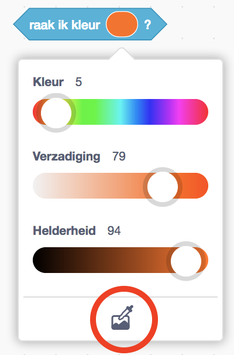{:width="300px"}
 
#### Bouwblokken

**Sprite beweegt tegen een kleur aan**

Dit bouwblok is het makkelijkst te gebruiken als je een losse webcam hebt die je op tafel kunt richten. In dit geval liggen de gekleurde voorwerpen (papiertjes, legoblokjes, M&M's, noem maar op) en beweegt een *sprite* tegen de voorwerpen aan. Je kunt dan programmeren wat er moet gebeuren als de sprite een kleur raakt: hij verandert van uiterlijk, er klinkt een geluid, je poppetje is "af", enzovoorts.

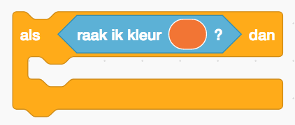{:width="300px"}

**Kleur beweegt tegen een sprite aan**

In dit geval gaat het er om dat een kleur op een bepaalde plek op het scherm verschijnt en Scratch daarop reageert. Om dat voor elkaar te krijgen doe je eigenlijk hetzelfde als in het vorige voorbeeld - bijvoorbeeld "als deze sprite kleur rood raakt", maar zit de sprite vast op één plek, bijvoorbeeld het linker- of rechterdeel van het scherm. Het kan voor je spelletje handig zijn om deze sprites te verbergen. Dit kun je doen door eerst op een sprite te klikken en daarna op het blok "verberg".

#### Mogelijke spelletjes

**Speed color: wie houdt het snelst de goede kleur in beeld**
- In dit spelletje speel je met twee spelers, en heeft elke speler één helft van het scherm (links en rechts).
- Tel af en laat dan een kleur zien, de spelers moeten nu de goede kleur papier omhoog houden.
- Tip: gebruik hiervoor de functie "willekeurig getal tussen 1 en ..."
- Extra moeilijk: laat de kleur die spelers omhoog moeten houden zien als *woord* met de letters in een andere kleur, bijvoorbeeld "blauw" maar dan met rode letters.

**Kleurenmuziek**
- Dit is een spelletje om muziek te maken met kleuren die je in beeld laat zien.
- Dit kan met een ingebouwde en losse webcam.
- Als je gekleurde voorwerpen op tafel legt kun je bijvoorbeeld een bewegende "streep" maken die steeds over het beeld schuift.

**Gekleurde platformen**
- In dit spel maak je een platform van gekleurde voorwerpen en moet een sprite daar overheen lopen/rennen.
- Begin met programmeren van de beweging van de sprite met een platform dat je in Sprite hebt getekend.
- Bepaal dan wat de kleuren moeten doen als je ze raakt (bijvoorbeeld opnieuw beginnen).
- Vervang dan het getekende platform door voorwerpen die de webcam ziet.
- Bonus: hieronder vind je een aantal tips om de beweging van de sprite minder schokkerig te maken.

#### Platform spel

**Het maken van een vloeiende beweging**

In Scratch kun je bewegen van links naar rechts, en van boven naar onder. De plek van links naar rechts wordt bepaald door de waarde van *x*, en die van boven naar onder door *y*. Deze waarden noem je de *coördinaten*.

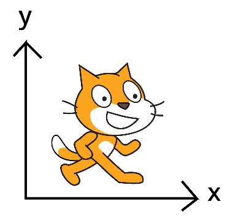{:width="300px"}

De makkelijkste manier om dit te doen is door een knop aan een verandering in de waarde van *x* en *y* te verbinden:
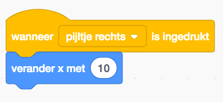{:width="300px"}

Dit kun je ook voor beweging de andere kant op, naar boven en beneden doen. Deze beweging is nogal schokkerig. Je kunt deze beweging op meerdere manieren vloeiender maken. Een manier is de volgende. Als eerste moet je hiervoor de waarde van *x* niet meteen als getal intypen, maar dit doen via een *variabele* die de snelheid van de sprite bepaalt (zie het menu 'variabelen'):

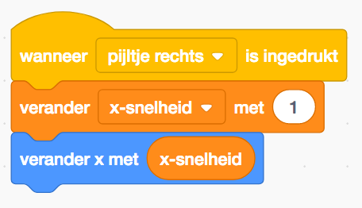{:width="300px"}

De volgende stap is om deze stap in een *herhaal* lus te zetten, daardoor blijft de snelheid veranderen zo lang je de knop ingedrukt houdt:

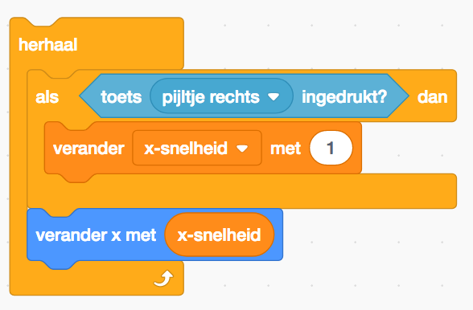{:width="350px"}

Wat er nu gebeurt is dat de sprite na het loslaten van de knop net zo snel blijft gaan. Je moet dus instellen dat de snelheid omlaag gaat als je de knop *niet* indrukt:

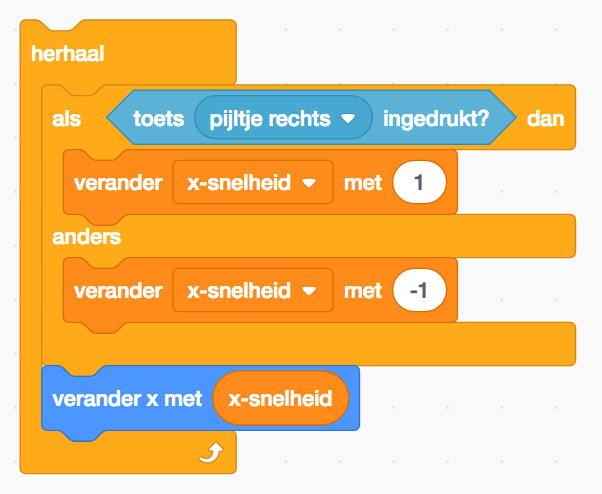{:width="350px"}

Je zult nu zien dat de snelheid na een tijdje onder de 0 gaat en de sprite dus de andere kant op zal gaan bewegen. O dit te voorkomen moet een je een voorwaarde toevoegen dat de snelheid niet onder de 0 mag komen.

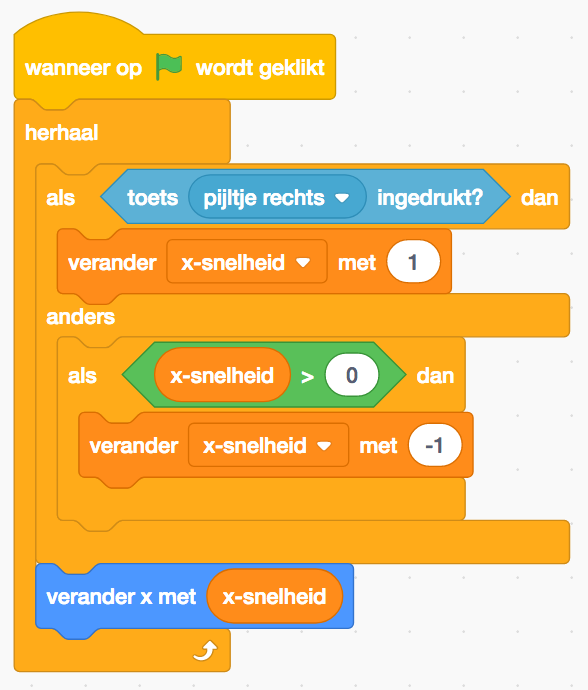{:width="350px"}

Beweging naar links kun je op dezelfde manier programmeren, uiteindelijk ziet het er dan zo uit:

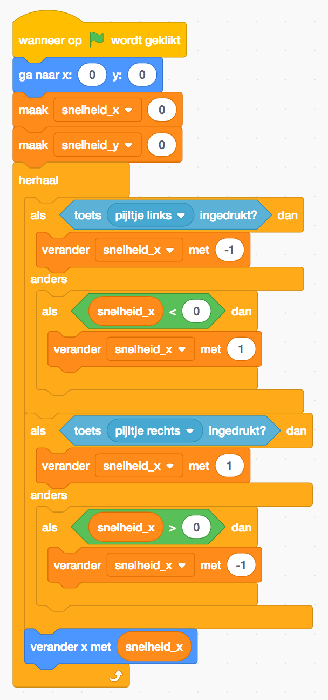{:width="350px"}

Je kunt de beweging nog verder verbeteren door een maximale snelheid te bepalen en de snelheid alleen te verhogen als die nog niet is bereikt. Je voegt dan een extra voorwaarde toe:

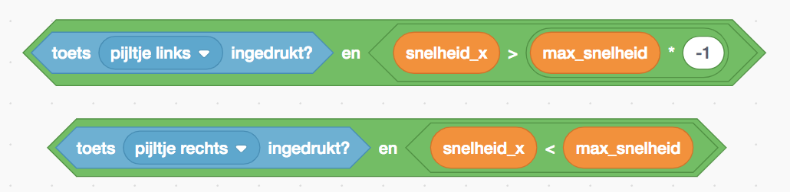{:width="350px"}

Natuurlijk hoort springen (en daarna weer vallen) ook bij een platform spel. Een manier om dit voor elkaar te krijgen zie je in het blok hieronder, waarbij 
Het blok hieronder een paar dingen doet:
- als je een onderdeel van het platform raakt is je snelheid in de _y_-richting 0
- als je op het platform staat en springt gaat je snelheid omhoog
- als je niet op het platform staat wordt je snelheid _y_-snelheid steeds hoger (je gaat naar beneden dus die wordt steeds meer negatief).

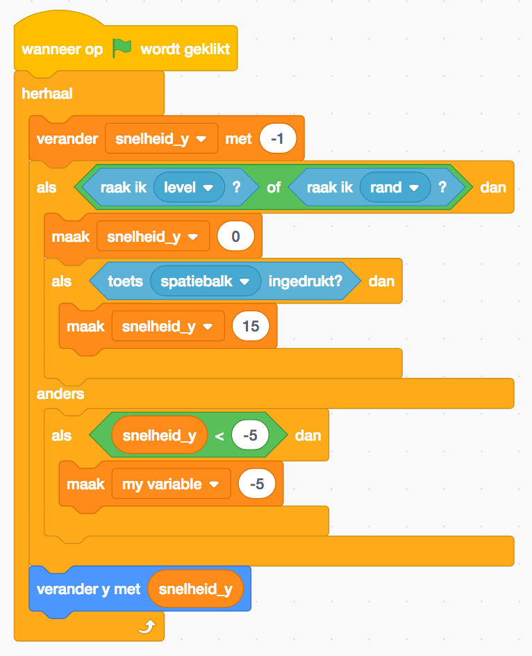{:width="350px"}

